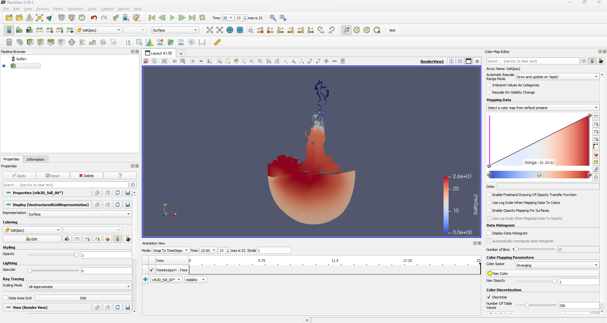

## 1. General Ocean Model (GOM)

## 2. Description: 
A three-dimensional unstructured grid finite-volume model for coastal and estuarine circulation, which I (Jungwoo Lee) named the General Ocean Model (GOM), has been developed. Combining the finite volume and finite difference methods, GOM achieved both the exact conservation and computational efficiency. The propagation term was implemented by a semi-implicit numerical scheme, so-called θ scheme, and the time-explicit Eulerian-Lagrangian Method (ELM) was used to discretize the nonlinear advection term to remove the major simulation limitations of the time step, which appears when solving shallow water equations, by the Courant-Friedrichs-Lewy stability condition. Because the GOM uses orthogonal unstructured computational grids, allowing both triangular and quadrilateral grids, considerable flexibility to resolve complex coastal boundaries is allowed without any transformation of governing equations. More fundamental details of the GOM can be found in the original development paper (Lee et al., 2020; https://doi.org/10.3390/w12102752) or in the model homepage, https://ufgom.org/publications/.

## 3. Installation:
Download the project folder:
  + Click the blue "Code" button on the right side of the window
  + Click "Download ZIP"
  
GOM is tested only with "gfortran", thus you need to install "gfortran" to compile the source codes. You also need to install "make" to compile the source codes.

If you are a Linux user:
  + $sudo apt-get install gfortran
  + $sudo apt install make

If you are a Windows user, download either "Cygwin" or "MSYS2" and install "gfortran" and "make":
  + Cygwin
    + Select "gfortran" & "make" and install
  + MSYS2
    + $pacman -S mingwo-w64-x86_64-gcc-fortran
    + $pacman -S make

Now, you are ready to go!

## 4. Compiling and Executing the code:
For more detail, read the user manual Chapter 5 for compiling and executing the code. It should be straightforward and easy.

Go to the source code folder (e.g.,):
  + ./GOM_Rv1.1.0/source/release/

Then, type the following commands to compile source codes:
  + $make clean
  + $make all

Now, you will see the compiling process, and you will have "run_release.exe" in the current folder (i.e., "release" folder).

Copy the executable, "run_release.exe" into your project folder, e.g.,
  + $cp run_release.exe ../../Projects/MB_test/1_barotropic_test/

Then, move to the project folder:
  + $cd ../../Projects/MB_test1/1_barotropic_test/

Now, let's check how many cores you have in your computer (if "lscpu" does not work, try "nproc" instead):
  + $lscpu
  + $nproc

Now, let's define how many cores you want to use for this simulation, e.g., if you want to use 4 cores:
  + $OMP_NUM_THREADS=4

Now, let's run the executable:
  + $./run_release.exe

Now, you will see the simulation progress on your terminal. These example projects are set to run for 1-day only, so change the simulation period as you want.

## 5. Folder Structure
This project has the following directory structure (e.g.,):
  + ./assets
    + This folder is nothing related to GOM model but to store the animation results
    + So, ignore this folder.
  + ./GOM_Rv1.1.0 (each version will have similar following folder structures)
    + ./Analytical_test
      + `not yet included`
    + ./Projects/MB_test/
      + `Note: this is the Mobile Bay test case, and this folder contains barotropic and baroclinic test cases`
      +  1_barotropic_test/
        + ./input
        + ./output
      + ./`your executable must be located here`

      +  2_baroclinic_test/
      + ./input
      + ./output
      + ./`your executable must be located here`
    + /source
      + /release/makefile
        + `this is the "makefile"`
      + / *.f90
        + `these are the source codes`
  	 + GOM_Manual_Rv1.0.0_draft_v1.pdf
      + `this is the user manual` for this version
  + ./README.TXT
    + This is the GOM version update notes.
    
Note 1: there are "place_holding.txt" in some folders, and this is nothing but to keep the folder structure since Github does not allow to keep an empty folder.

Note 2: one of the input files, "hurricane_ser.inp", in Projects/MB_test/2_baroclinic_test/input/, is included as a zip file since there is a file size limit in Githup. So, you should unzip it first.
        

## 5. License:
Read "GOM License Agreement" in the user manual.

## 6. Application results:
Notice: you will have faster simulation results with TecPlot. 
Here is how you can easily check the 2D & 3D output results with ParaView: [Screencastify](https://drive.google.com/file/d/1x3sdVGrJh_wmawIfCdjk8IdT4dNxBq2B/view) 
or the original video file is in: `./assets/3D_output.avi` 
 

## 8. Questions?:
If you have any questions, feel free to contact me via information below: 
[Email:] leejung24@ecu.edu or jungwoo33@gmail.com

- - -
© 2023 Jungwoo Lee. Confidential and Proprietary. All Rights Reserved.
