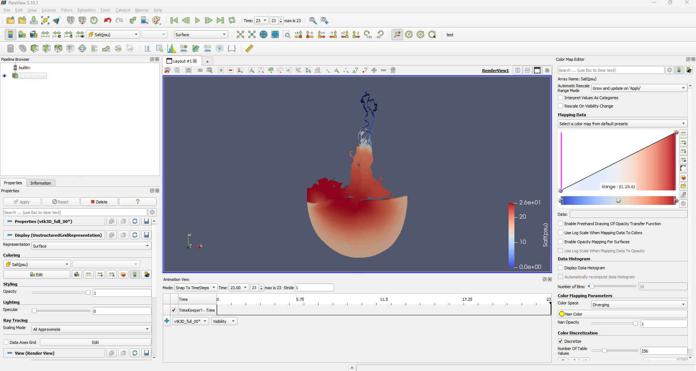

## 1. Model Name: The General Ocean Model (GOM)

## 2. Description: 
A three-dimensional unstructured grid finite-volume model for coastal and estuarine circulation, which I (Jungwoo Lee) named the General Ocean Model (GOM), has been developed. Combining the finite volume and finite difference methods, GOM achieved both the exact conservation and computational efficiency. The propagation term was implemented by a semi-implicit numerical scheme, so-called θ scheme, and the time-explicit Eulerian-Lagrangian Method (ELM) was used to discretize the nonlinear advection term to remove the major simulation limitations of the time step, which appears when solving shallow water equations, by the Courant-Friedrichs-Lewy stability condition. Because the GOM uses orthogonal unstructured computational grids, allowing both triangular and quadrilateral grids, considerable flexibility to resolve complex coastal boundaries is allowed without any transformation of governing equations. More fundamental details of the GOM can be found in the original development paper (Lee et al., 2020; https://doi.org/10.3390/w12102752) or in the model homepage, https://ufgom.org/publications/.

## 3. Installation:
Download this project folder, then use "gfortran" to compile the source codes, i.e., `git clone` the repo down to your local pc. Now, you are ready to go!
GOM is tested with "gfortran" only. Thus, you need to install "gfortran". 

## 4. Folder Structure
This project has the following directory structure (e.g.,):
  + ./assets
    + This folder is nothing related to GOM model but to store the animation results
  + ./GOM_Rv1.0.0
    + ./Analytical_test
      + `not yet included`
    + ./Projects/MB_test/2_baroclinic_test/
      + ./input
      + ./output
      + ./`your executable must be located here`
      + `Note: this is the Mobile Bay test case`
    + /source
      + /release/makefile
        + `this is the "makefile"`
      + / *.f90
        + `these are the source codes`
  + GOM_Manual_Rv1.0.0_draft_v1.pdf
    + `this is the user manual`

Note 1: there are "place_holding.txt" in some folders, and this is nothing but to keep the folder structure since Github does not allow to keep an empty folder.
Note 2: one of the input files, "hurricane_ser.inp", in Projects/MB_test/2_baroclinic_test/input/, is included as a zip file since there is a file size limit in Githup. So, you should unzip it first.
        
## 5. Compiling and Executing the code:
Read the user manual Chapter 5 for compiling and executing the code. It should be very easy.

## 5. License:
Read "GOM License Agreement" in the user manual.

## 6. Application results:
Notice: you will have faster simulation results with TecPlot. 
Here is how you can easily check the 2D & 3D output results with ParaView: [Screencastify](https://drive.google.com/file/d/1x3sdVGrJh_wmawIfCdjk8IdT4dNxBq2B/view) 
or the original video file is in: `./assets/3D_output.avi` 
 

## 8. Questions?:
If you have any questions, feel free to contact me via information below: 
[Email:] leejung24@ecu.edu or jungwoo33@gmail.com

- - -
© 2023 Jungwoo Lee. Confidential and Proprietary. All Rights Reserved.
